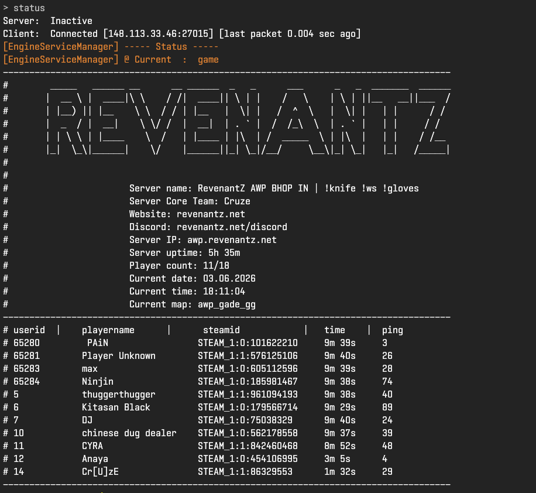

# Status Modifier
Modify `status` message the way you want & remove players you don't want to display.

## Placeholders
| Placeholder | Description | Example Output |
|------------|-------------|----------------|
| `{MAXPLAYERS}` | Maximum number of players allowed on the server | `64` |
| `{SERVERIP}` | The server's IP address | `192.168.1.1:27015` |
| `{PLAYERCOUNT}` | Current number of players on the server | `37` |
| `{SERVERNAME}` | The server's name | `CS2 server` |
| `{CURRENTMAP}` | The current map name | `de_dust2` |
| `{CURRENTDATE}` | Current date in dd-MM-yyyy format | `14-07-2026` |
| `{CURRENTTIME}` | Current time in HH:mm:ss format | `10:10:38` |
| `{CURRENTDATETIME}` | Current date and time | `14-07-2026 14:07:26` |
| `{UPTIME}` | Server uptime (displays plugins load time) | `14h 07m 26s` |
| `{PLAYERIP}` | The player's IP address | `192.168.1.100` |
| `{PLAYERNAME}` | The player's name | `PlayerName123` |
| `{PLAYERUSERID}` | The player's userid | `3` |
| `{PLAYERSCORE}` | The player's score | `14` |
| `{PLAYERPING}` | The player's ping | `67` |
| `{PLAYERTIME}` | The player's connection time | `45m 34s` |
| `{STEAMID}` | The player's SteamID | `76561198012345678` |
| `{STEAMID32}` | The player's SteamID | `STEAM_0:0:569544375` |
| `{STEAMID3}` | The player's SteamID | `[U:1:1139088750]` |